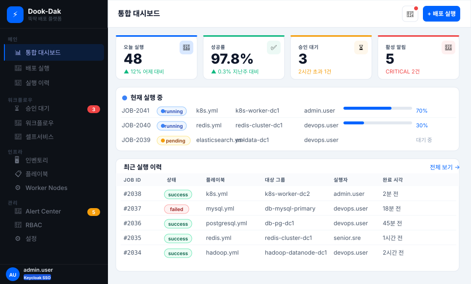
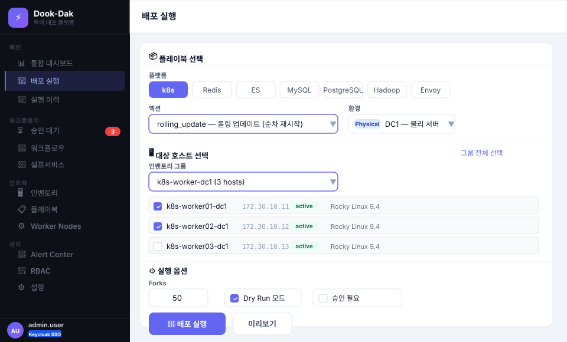
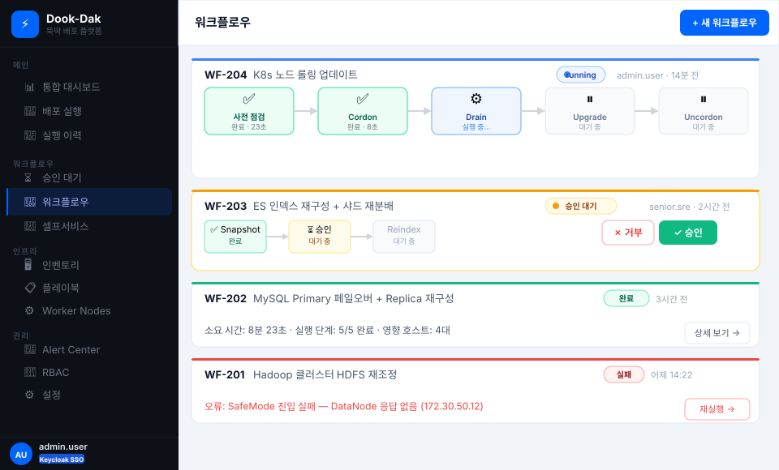
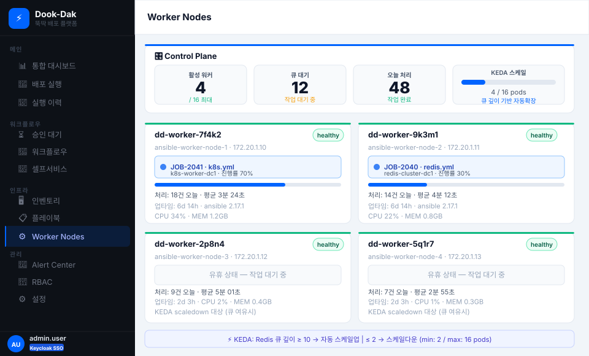

# Dook-Dak (뚝딱) 🚀

> **Ansible 기반 통합 배포 플랫폼** — 뚝딱 업무를 해치우는 Self-Service 인프라 배포 툴

[](https://golang.org)
[](https://reactjs.org)
[](https://ansible.com)
[](https://keycloak.org)

---

## 개요

AWX의 불편한 UX를 대체하여 **대규모 인프라(Physical DC, OpenStack, ESXi, AWS, GCP)**를 단일 셀프서비스 플랫폼으로 통합 관리합니다.

- **10,000+ 서버** 대상 배포 지원
- **Keycloak SSO** 인증 (OIDC/SAML 2.0)
- **RBAC** 기반 세밀한 권한 제어
- **Ansible Worker 풀** (replicas 조정 / 필요시 HPA)
- **실시간 로그 스트리밍** (WebSocket)
- **승인 기반 배포 워크플로우**
- **CMDB 자동 동기화** + Static JSON 캐시 (고성능 인벤토리)

---

## UI 미리보기

> 인터랙티브 프로토타입

### 통합 대시보드
실행 중인 배포 현황, 성공률, 승인 대기, 알림을 한눈에 확인합니다.



### 배포 실행
플랫폼 · 액션 · 환경 · 대상 호스트를 선택하고 배포를 트리거합니다. Dry Run 모드와 승인 워크플로우를 지원합니다.



### 워크플로우
다단계 파이프라인의 실시간 진행 상황을 추적하고 승인/거부를 처리합니다.



### Worker Nodes
Ansible Worker Pod의 실행 현황과 replicas 상태를 모니터링합니다.



---

## 빠른 시작 (로컬 개발)

### 사전 요구사항

| 도구 | 버전 |
|------|------|
| Docker + Docker Compose | 4.x+ |
| Go | 1.22+ |
| Node.js | 20+ |
| Make | any |

### 1단계: 설정

```bash
git clone https://github.com/your-org/dookdak.git
cd dookdak

# .env 파일 생성 (값 수정 필요)
make setup
```

### 2단계: 개발 환경 실행

```bash
# 전체 스택 실행 (PostgreSQL + Redis + Keycloak + Temporal + API + Worker + Frontend)
make dev

# 또는 인프라만 먼저 실행 후 로컬에서 API/Worker/Frontend 개별 실행
make dev-infra
make api       # 별도 터미널
make worker    # 별도 터미널
make fe        # 별도 터미널
```

### 3단계: 초기 DB 마이그레이션

```bash
make migrate-up
```

### 4단계: Keycloak 초기 설정

```bash
make keycloak-setup
```

### 5단계: 접속

| 서비스 | 주소 |
|--------|------|
| **Dook-Dak UI** | http://localhost:5173 |
| **API** | http://localhost:8080 |
| **Keycloak 관리자** | http://localhost:8180 (admin/admin) |
| **Temporal UI** | http://localhost:8088 |

**테스트 계정:**
- `admin.user` / `admin123` → Platform Admin
- `devops.user` / `devops123` → DevOps
- `dev.user` / `dev123` → Developer

---

## 프로젝트 구조

```
dookdak/
├── .env.example          # 환경변수 템플릿 (→ .env 복사 후 수정)
├── Makefile              # 개발/배포 편의 명령어
│
├── frontend/             # React 18 + TypeScript + Vite
│   └── src/
│       ├── api/          # API 클라이언트 (Axios)
│       ├── hooks/        # 커스텀 훅 (WebSocket 로그, 폴링 등)
│       ├── stores/       # Zustand 상태 관리
│       ├── pages/        # 12개 페이지 컴포넌트
│       └── components/   # 공통 UI 컴포넌트
│
├── backend/              # Go + Echo v4
│   ├── cmd/
│   │   ├── api/          # API 서버 진입점
│   │   └── worker/       # Ansible Worker 진입점
│   └── internal/
│       ├── api/          # 핸들러 + 미들웨어 + WebSocket Hub
│       ├── config/       # 환경변수 기반 설정
│       ├── model/        # 데이터 모델
│       ├── repository/   # DB 쿼리 계층
│       ├── service/      # 비즈니스 로직 (알림 등)
│       └── worker/       # Ansible Runner + Asynq 큐 처리
│
├── ansible/
│   ├── ansible.cfg       # Ansible 전역 설정
│   └── playbooks/        # 플레이북 (11종)
│       ├── k8s.yml         # Kubernetes 노드 관리
│       ├── redis.yml       # Redis Cluster 관리
│       ├── elasticsearch.yml
│       ├── mysql.yml
│       ├── postgresql.yml
│       ├── impala.yml
│       ├── hadoop.yml
│       └── envoy.yml
│
├── data/inventory/       # CMDB 동기화 결과 (Static JSON)
│
├── scripts/
│   └── sync-cmdb.sh      # CMDB 인벤토리 동기화
│
├── deploy/
│   ├── docker-compose.yml        # 개발 환경
│   ├── keycloak/realm-export.json
│   ├── scripts/keycloak-setup.sh
│   └── k8s/              # Kubernetes 매니페스트
│       ├── namespace.yaml
│       ├── api-deployment.yaml   # + HPA
│       ├── worker-deployment.yaml # Worker Deployment (+ 선택적 HPA)
│       ├── ingress.yaml
│       ├── configmap.yaml
│       └── secret.yaml
│
├── MVP.html              # UI 프로토타입 (디자인 레퍼런스)
└── ARCHITECTURE.md       # 아키텍처 상세 문서
```

---

## 주요 Make 명령어

```bash
make help          # 전체 명령어 목록

# 개발
make dev           # 전체 스택 실행
make dev-infra     # 인프라만 실행 (DB+Redis+Keycloak)
make down          # 중지

# 로컬 실행
make api           # API 서버
make worker        # Ansible Worker
make fe            # Frontend

# DB
make migrate-up    # 마이그레이션 실행
make migrate-down  # 롤백
make migrate-create name=add_something  # 새 마이그레이션

# 빌드/배포
make build         # Docker 이미지 빌드
make k8s-apply     # K8s 배포

# 기타
make sync-cmdb     # CMDB 수동 동기화
make health        # API 헬스체크
make logs          # 전체 로그
```

---

## 환경변수 설명

`.env.example`를 참고하세요. 필수 항목:

| 변수 | 설명 | 기본값 |
|------|------|--------|
| `DATABASE_URL` | PostgreSQL 연결 문자열 | — |
| `REDIS_URL` | Redis 주소 | `localhost:6379` |
| `KEYCLOAK_URL` | Keycloak 서버 주소 | `http://localhost:8180` |
| `KEYCLOAK_CLIENT_SECRET` | Keycloak Client Secret | — |
| `ANSIBLE_PLAYBOOK_DIR` | 플레이북 디렉토리 | `/opt/dookdak/playbooks` |
| `ANSIBLE_INVENTORY_DIR` | 인벤토리 JSON 디렉토리 | `/opt/dookdak/inventory` |
| `SLACK_WEBHOOK_URL` | Slack 알림 Webhook | — |

---

## 운영 배포 (Kubernetes)

```bash
# 네임스페이스 + Secret 생성
kubectl create namespace dookdak
kubectl create secret generic dookdak-secrets \
  --from-literal=DATABASE_URL="postgres://..." \
  --from-literal=KEYCLOAK_CLIENT_SECRET="..." \
  -n dookdak

# 전체 배포
make k8s-apply

# Worker 스케일 조정
make k8s-scale-worker replicas=8
```

Worker는 기본 replicas로 운영하며, 부하에 따라 `make k8s-scale-worker`로 조정하거나 HPA(CPU)로 자동 확장할 수 있습니다 (on-prem 기준, 운영 중 정책 결정).

---

## 라이선스

MIT License — 내부 사용 목적
